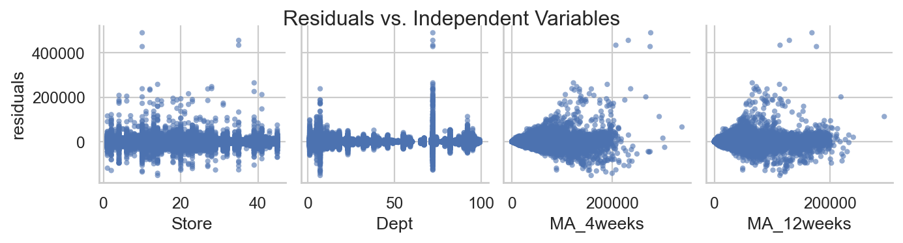
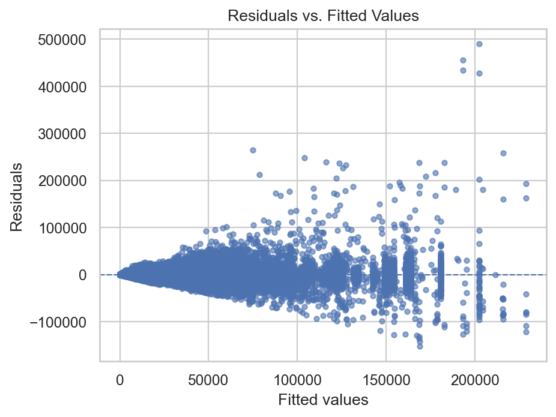

<<<<<<< HEAD
# Walmart Sales Forecast

End-to-end sales forecasting project using Python, LightGBM, and advanced feature engineering. Includes **data preprocessing**, **model selection**, **hyperparameter tuning**, and **residual analysis** to evaluate model assumptions and performance.

---

## 📌 Highlights
- Full workflow in a single Jupyter notebook: from data cleaning to model evaluation
- **LightGBM** selected as the optimal model
- **Step 27 — Residual Analysis** to check non-linearity, heteroskedasticity, and outliers
- Clear visuals for residual diagnostics

---

## 📂 Project Structure
├─ notebooks/
│ └─ walmart_sales_forecast.ipynb
├─ src/ # utility functions (optional)
├─ data/ # (ignored) raw and intermediate data
├─ models/ # (ignored) trained models
├─ reports/
│ └─ figures/
│ ├─ residuals_vs_features.png
│ └─ residuals_vs_fitted.png
├─ requirements.txt
├─ .gitignore
└─ README.md


---

## 🧠 Approach
1. Load & clean Walmart sales data
2. Engineer features (lags, rolling means, calendar effects, promotions)
3. Compare models → select optimal LightGBM
4. Perform **Residual Analysis**:
   - Pairplot of residuals vs features
   - Residuals vs fitted values

---

## 📊 Residual Analysis
Residuals vs features (left) and vs fitted values (right):

 

**Interpretation guide:**
- Random scatter around 0 → good
- Curves or patterns → non-linearity
- Funnel shape → heteroskedasticity
- Extreme points → possible outliers

---

## 🚀 How to run
```bash
# 1) Create environment
python -m venv .venv
# Windows PowerShell:
. .\.venv\Scripts\Activate.ps1
pip install -r requirements.txt

# 2) Launch notebook
jupyter notebook notebooks/walmart_sales_forecast.ipynb

📈 Results

Cross-validation metric: [add here]

Test set metric: [add here]

📄 License

MIT License

---

## 2️⃣ Save the file
- **File name:** `README.md`
- **Save as type:** All Files
- **Encoding:** UTF-8
- **Location:** `C:\Users\Rahil\WalmartForecast`

---

=======
# Walmart-sales-forecast
End-to-end Walmart sales forecasting project using Python, LightGBM, and advanced feature engineering. Includes data preprocessing, model selection, hyperparameter tuning, and a comprehensive residual analysis to evaluate model performance and assumptions.
>>>>>>> b6e4ee334110aac7974450a3414062e1f08e0924
