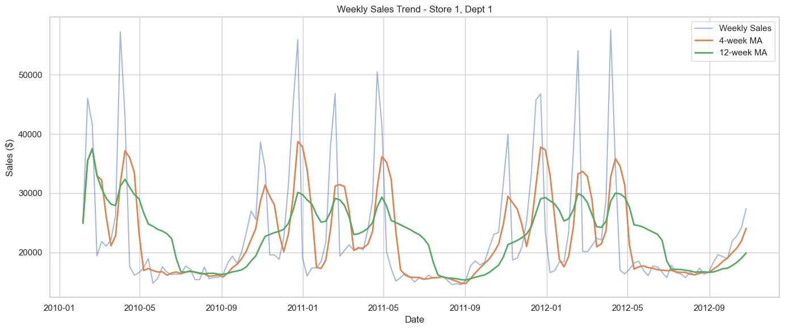
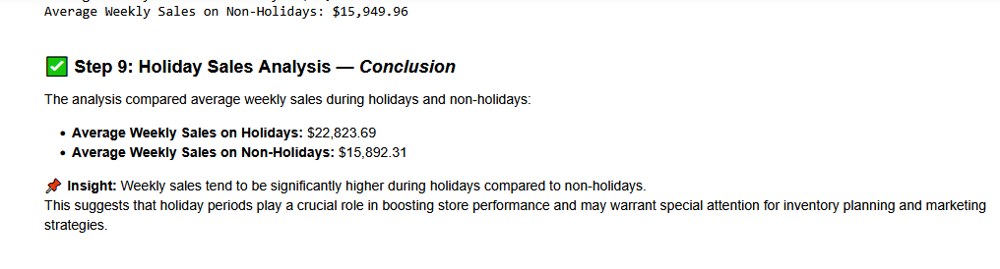
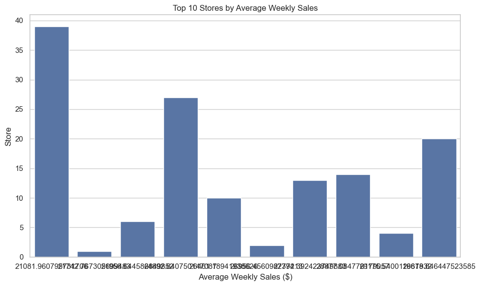
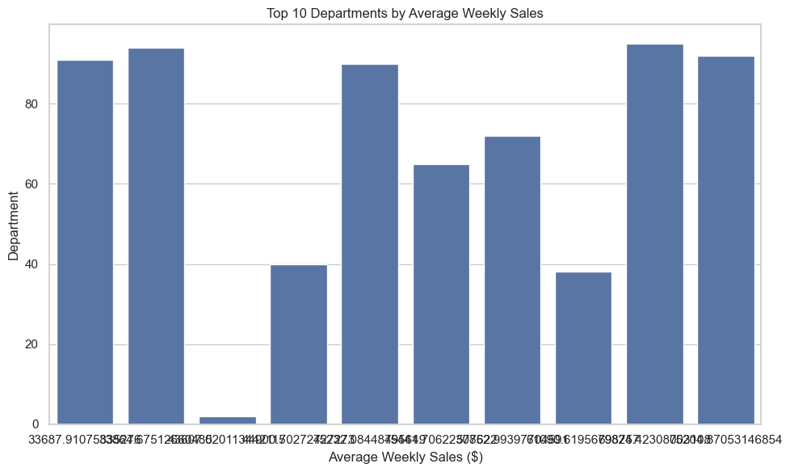
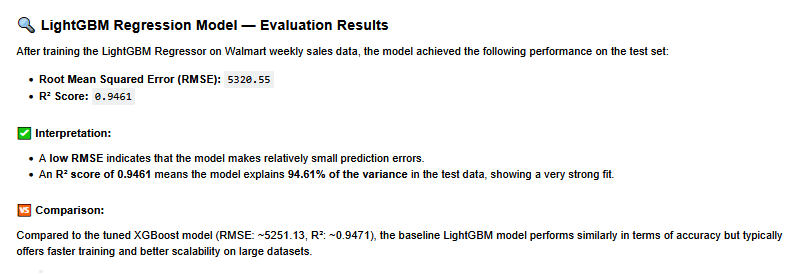

# Walmart Sales Forecasting 🛒📈

## 📌 Project Overview
This project focuses on forecasting weekly sales for Walmart stores across the United States.  
The dataset is sourced from Kaggle’s [Walmart Recruiting - Store Sales Forecasting](https://www.kaggle.com/competitions/walmart-recruiting-store-sales-forecasting/data).  

The main goal is to **build predictive models** that can accurately estimate future sales, taking into account seasonal effects, holidays, and store/department-specific patterns.  

---

## 📊 Dataset Description
The dataset contains **421,570 records** with the following features:

- **Store** – Store ID  
- **Dept** – Department number  
- **Date** – Weekly sales date  
- **Weekly_Sales** – Total weekly sales  
- **IsHoliday** – Indicates whether the week includes a holiday  

Key insights from exploration:  
- No missing values  
- No duplicates  
- Some negative sales values (likely returns or anomalies)  

---

## 🔍 Project Workflow
The project is structured in sequential steps inside the Jupyter notebook:

1. **Dataset Overview**  
   - Inspected data types, missing values, and dataset structure.  
   - Found anomalies in weekly sales.  

2. **Data Cleaning**  
   - Removed duplicates and missing values.  
   - Handled invalid negative sales values.  

3. **Exploratory Data Analysis (EDA)**  
   - Generated descriptive statistics.  
   - Analyzed sales trends over time, by store, and by department.  
   - Compared holiday vs non-holiday weeks.  

   **Figures:**  
   -   
   -   
   -   
   -   

4. **Feature Engineering**  
   - Created new variables for seasonality and trend capture.  
   - Encoded categorical variables.  

5. **Modeling**  
   - Implemented forecasting models including regression-based and tree-based methods.  
   - Evaluated models with metrics such as RMSE, MAE, and RMSLE.  

   **Figures:**  
   -   

6. **Results & Insights**  
   - Sales strongly influenced by holidays.  
   - Different departments show unique seasonal patterns.  
   - Advanced models (e.g., Random Forest, Gradient Boosting) outperform baseline regression.  

---

## ⚙️ Technologies Used
- **Python** (Pandas, NumPy, Scikit-learn, Matplotlib, Seaborn, LightGBM)  
- **Jupyter Notebook** for development and documentation  
- **Kaggle** dataset hosting  

---

## 📈 Results & Visualizations
The notebook includes detailed charts and plots for:  
- Weekly sales distribution  
- Store-level comparisons  
- Holiday effect on sales  
- Model performance evaluation  

---

## 🚀 How to Run
1. Clone this repository:
   ```bash
   git clone https://github.com/your-username/walmart-sales-forecast.git
   cd walmart-sales-forecast
   ```
2. Install dependencies:
   ```bash
   pip install -r requirements.txt
   ```
3. Download the dataset from [Kaggle](https://www.kaggle.com/competitions/walmart-recruiting-store-sales-forecasting/data) and place the files in the `data/` directory.  
4. Open and run the Jupyter notebook:
   ```bash
   jupyter notebook walmart_sales_forecast.ipynb
   ```

---

## 📌 Future Improvements
- Implement advanced time series models (Prophet, LSTM, ARIMA).  
- Automate hyperparameter tuning.  
- Deploy model as a web service or dashboard.  

---

## 👤 Author
**Amin Hassanzadeh**  
📍 Gaithersburg, MD  
🔗 [LinkedIn](https://www.linkedin.com/in/amin-hassanzadeh-062024222)  
